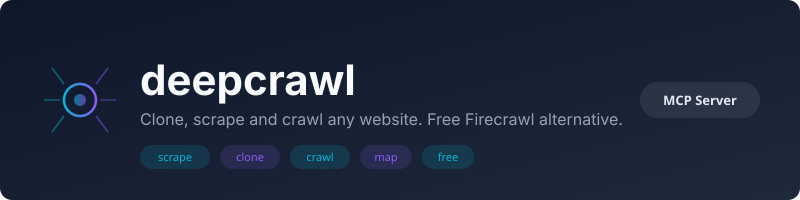

<p align="center">
  
</p>

<p align="center">
  <a href="https://www.npmjs.com/package/deepcrawl-mcp"></a>
  
  
  
</p>

<p align="center">
  <a href="cursor://anysphere.cursor-deeplink/mcp/install?name=deepcrawl-mcp&config=eyJ0eXBlIjoic3RkaW8iLCJjb21tYW5kIjoibnB4IiwiYXJncyI6WyIteSIsImRlZXBjcmF3bC1tY3BAbGF0ZXN0Il19"></a>
  <a href="https://soflution1.github.io/BrandCheck/install.html?name=deepcrawl-mcp&pkg=deepcrawl-mcp"></a>
</p>

---

**Clone, scrape and crawl any website.** Free Firecrawl alternative. No API keys, no rate limits, no subscription.

## Quick Start

**Cursor (one-click):** Click the "Install in Cursor" button above.

**Manual MCP config:**
```json
{
  "mcpServers": {
    "deepcrawl-mcp": {
      "command": "npx",
      "args": ["-y", "deepcrawl-mcp@latest"]
    }
  }
}
```

**CLI:**
```bash
npx deepcrawl-mcp@latest
```

## Tools

### `deepcrawl_scrape`
Scrape a single page and return clean markdown. Extracts title, description, links, images, and metadata. Strips navigation, footer, ads, and tracking.

```
"Scrape https://example.com and give me the main content"
```

| Parameter | Default | Description |
|-----------|---------|-------------|
| `url` | required | Page URL to scrape |
| `mainContentOnly` | `true` | Extract only main content (skip nav/footer) |
| `includeLinks` | `true` | Include discovered links |
| `includeImages` | `true` | Include image URLs |

### `deepcrawl_clone`
Clone a full page with all assets: HTML, CSS, JS, images, fonts, favicons. Downloads everything into a local folder, rewrites URLs to relative paths. Open `index.html` in a browser and it works.

```
"Clone https://competitor.com into a local folder"
```

| Parameter | Default | Description |
|-----------|---------|-------------|
| `url` | required | Page URL to clone |
| `outputDir` | `~/deepcrawl-clones/<domain>` | Output folder |
| `depth` | `0` | Link depth: 0 = single page, 1+ = follow links |

### `deepcrawl_crawl`
Crawl an entire site following internal links. Returns every page as clean markdown. Great for content analysis, SEO audit, or feeding a RAG pipeline.

```
"Crawl https://docs.example.com and return all pages as markdown"
```

| Parameter | Default | Description |
|-----------|---------|-------------|
| `url` | required | Starting URL |
| `maxPages` | `20` | Max pages to crawl (max: 100) |
| `includeImages` | `false` | Include image URLs per page |

### `deepcrawl_map`
Discover all URLs from a site via sitemap.xml parsing and homepage link crawling. Run this before a crawl to see the site's scope.

```
"Map all pages on https://example.com"
```

| Parameter | Default | Description |
|-----------|---------|-------------|
| `url` | required | Site URL |
| `maxUrls` | `200` | Max URLs to discover |

## vs Firecrawl

| | deepcrawl | Firecrawl |
|---|---|---|
| Price | Free | $19+/mo |
| API key | None | Required |
| Rate limits | None | Yes |
| Scrape to markdown | Yes | Yes |
| Full site crawl | Yes | Yes |
| Site map | Yes | Yes |
| Clone with assets | **Yes** | No |
| JS rendering | No (static HTML) | Yes |
| Anti-bot bypass | No | Yes |

deepcrawl handles static sites perfectly. For JS-heavy SPAs that require browser rendering, Firecrawl or PageMap are better choices.

## Also by Soflution

- **[brandcheck](https://github.com/Soflution1/BrandCheck)** - Check brand name availability across 27 platforms
- **[depsonar](https://github.com/Soflution1/depsonar)** - Dependency audit, security scan, license check

## License

MIT
